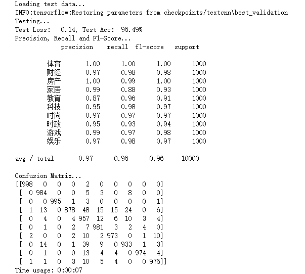
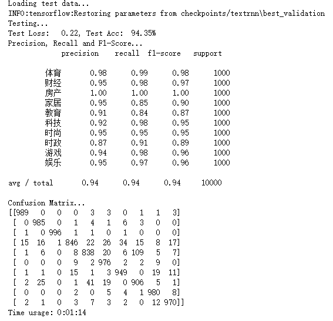

# TextClassification
Text classification projects.         To be continued

### 1. [新闻文本分类（bow tf-idf w2v）](ch_text_classification/)
   > 使用三种方法进行了分类，其中word2vec计算doc vec使用了[GoogleNews-vectors-negative300.bin.gz](https://github.com/mmihaltz/word2vec-GoogleNews-vectors)
   
   tf-idf效果最好，另外可以进一步过滤不同种类新闻的共有高频词，进一步提高分类效果。[[code]](ch_text_classification/ch_text_classification.ipynb)

***
### 2. [CNN文本分类](CNN_text_classification/)
   > 使用CNN对文本进行编码分类。采用字为单位的embedding方式，对文本进行编码，当然可以考虑分词之后进行词的embedding。
   > 或者将两者concat作为输入。
   
   [文件夹](CNN_text_classification/)中有模型说明notebook，[source_code](CNN_text_classification/source_code/)包含了代码和结果。[helper](CNN_text_classification/source_code/helper/)文件夹中有raw data数据处理的script。训练模型运行[run_cnn.py](CNN_text_classification/source_code/helper/run_cnn.py)
   运行结果如下：
   > 
   
***
### 3. [RNN文本分类](RNN_text_classification/)
   > 使用LSTM对文本进行编码分类。采用字为单位的embedding方式，采用多层LSTM最后一个time step的输出作为文本的编码。
   
   [文件夹](RNN_text_classification/)中有模型说明notebook，[source_code](RNN_text_classification/source_code/)包含了代码和结果。[helper](RNN_text_classification/source_code/helper/)文件夹中有raw data数据处理的script。训练模型运行[run_cnn.py](RNN_text_classification/source_code/helper/run_cnn.py)。
   [LSTM layer code](RNN_text_classification/source_code/lstm_layer_implement.py)
   运行结果如下：
   >   
